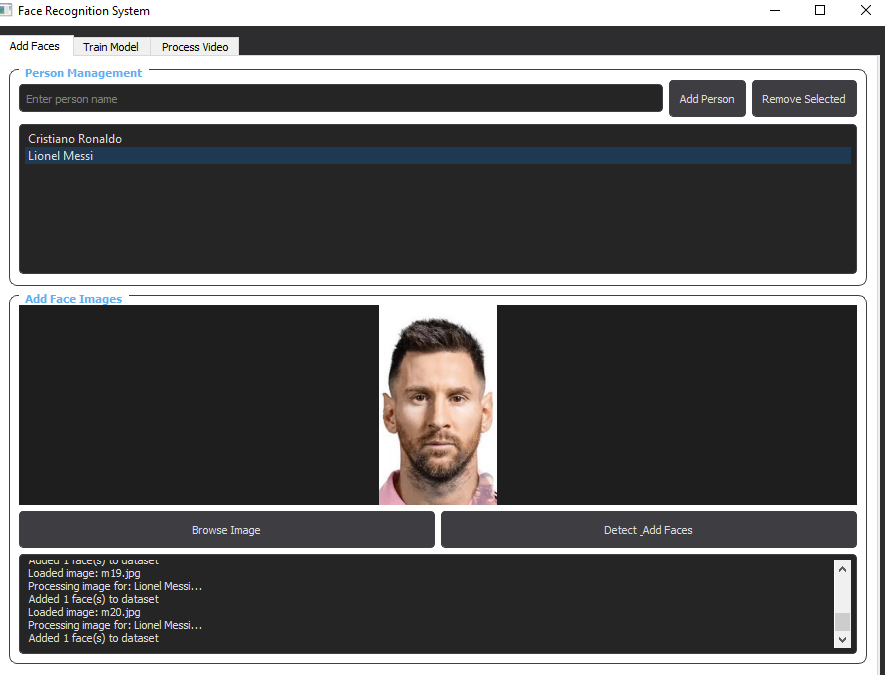
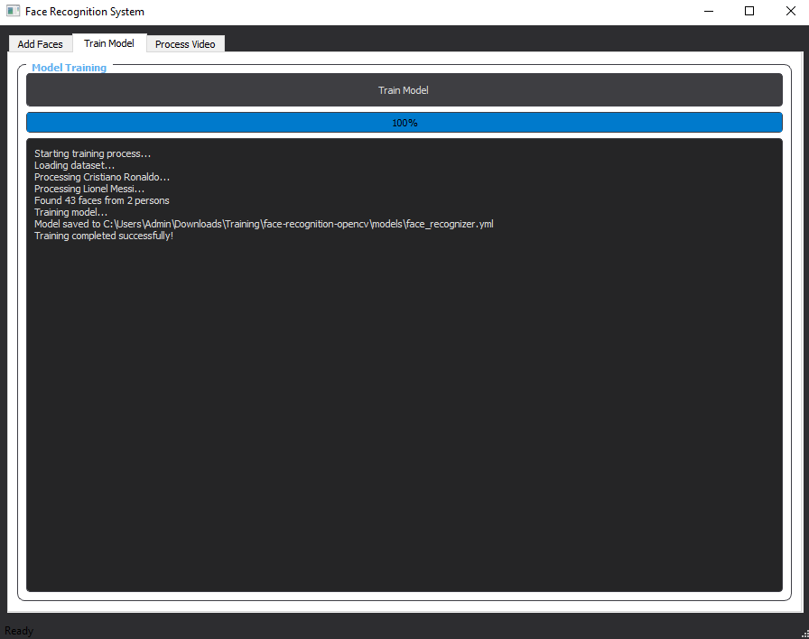
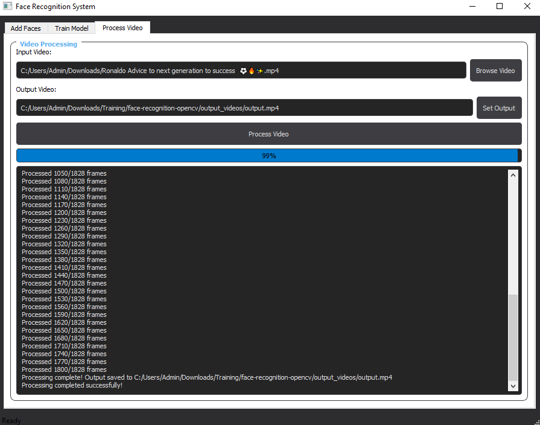

# Face Recognition GUI with OpenCV

A user-friendly desktop application for face detection and recognition in videos using **OpenCV** and **PyQt5**.  
This tool allows you to:

- Add known faces to the system through a simple GUI  
- Train a recognition model with one click  
- Process videos to detect and label recognized faces  
- Save annotated videos with bounding boxes and names

---

## GUI Tabs Screenshots

### Add Faces Tab

### Train Model Tab

### Process Video Tab

---

## 🚀 Usage

### 1. Add People and Faces
- Go to the **"Add Faces"** tab  
- Enter a name and click **"Add Person"**  
- Select a photo containing the person  
- Click **"Detect & Add Faces"**  
- Repeat with **5–10 photos per person** for best results  

### 2. Train the Model
- Go to the **"Train Model"** tab  
- Click **"Train Model"**  
- Wait for progress bar to reach **100%**  
- Verify **"Training completed successfully!"** appears  

### 3. Process Videos
- Place video files in the `input_videos` folder  
- Go to the **"Process Video"** tab  
- Select input video and output path  
- Click **"Process Video"**  
- Find results in the `output_videos` folder  

---

## 🧠 How It Works

### Technical Components

| Component         | Technology                      |
|------------------|----------------------------------|
| Face Detection   | Haar Cascade classifier         |
| Face Recognition | LBPH (Local Binary Patterns Histograms) |
| Video Processing | Frame-by-frame analysis with OpenCV |
| GUI Framework    | PyQt5                           |

---

### Recognition Process

1. **Detection:** Locate faces in video frames  
2. **Alignment:** Crop and resize face regions  
3. **Recognition:** Compare against trained faces  
4. **Annotation:** Draw bounding boxes and labels  

**Color Codes:**
- 🟩 **Green:** High confidence (>70%)  
- 🟥 **Red:** Low confidence  
